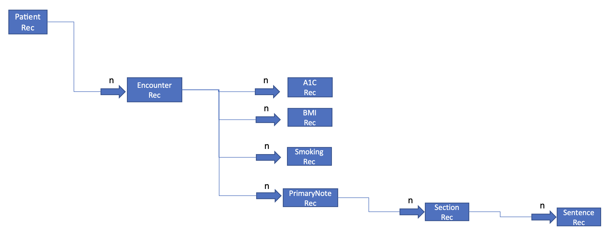
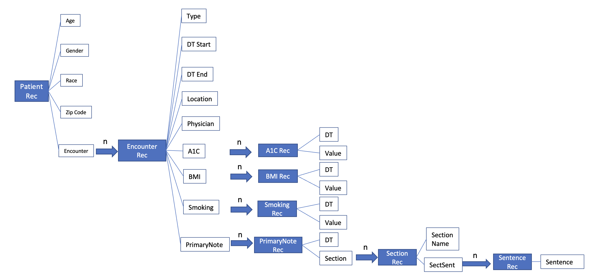
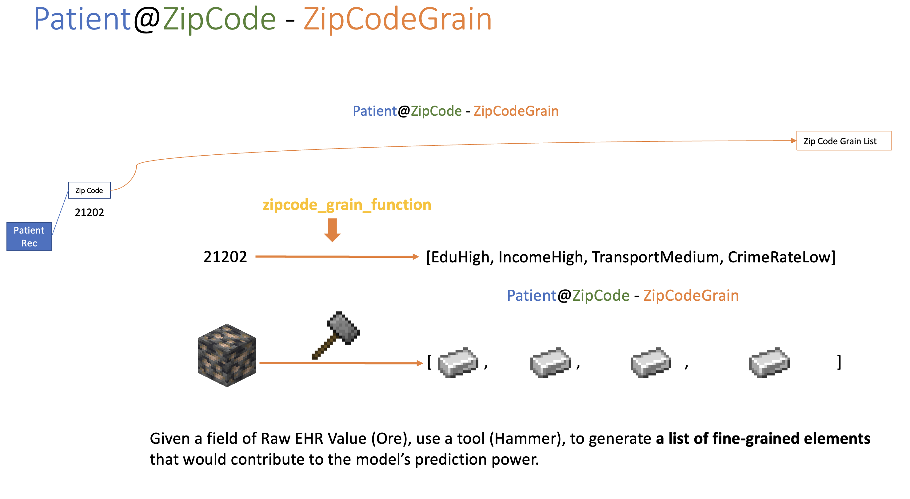
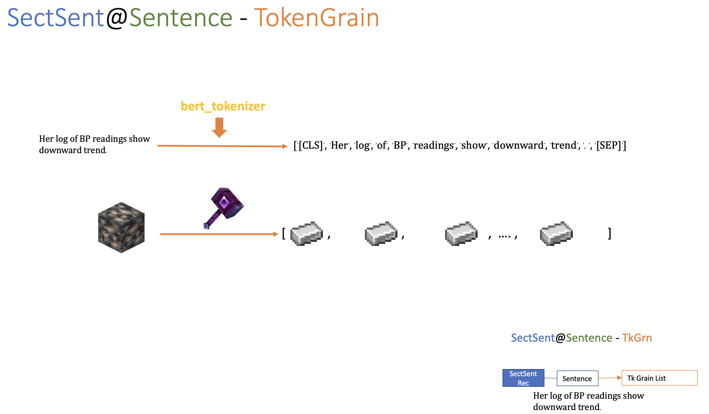
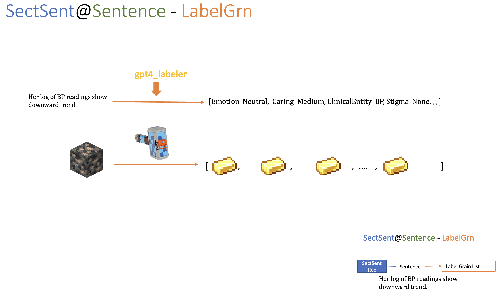
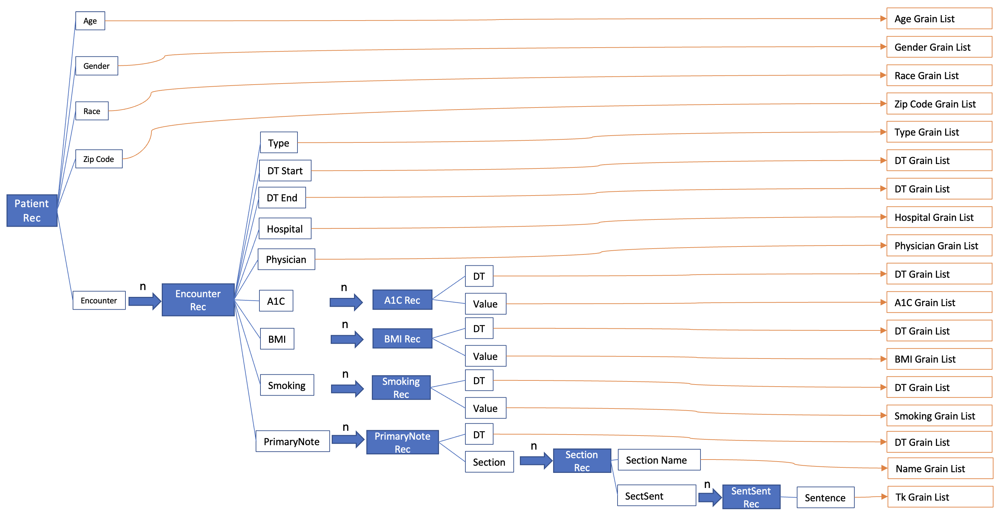

# 1. RecFldGrn Framework

This is a repo to show the idea of `RecFldGrn`, which indicates the `Record-Field-Grain` framework. 

* `Record`: A record type can be (1) potiential can have multiple `Field`s (or columns). The records can be multiple. For example, one patient can have multiple `A1C Record`, or `Diagnosis Record`. But one patient cannot have multiple `Age Record`s (Given one index date, in some cases, we can convert `Age` to records, too). In the most case, we treat `Age` as the field for the `Patient Record`, similar to `Race` and `Gender`. 

* `Field`: A field describes a dimension of a record (It is more like a column). 

* `Grain`: Given the raw value from a record's field, leverage a `fldgrn_fn` to convert the raw value to a list of fine-grained elements, which contains richer information to the outcome. 

This repo contains a simulated dataset to demonstrate how `RecFldGrn` framework works.

# 2. Record

The `Unit of Observation` is a patient. So we started with a `Patient Record`.

`One Patient Record` can have multiple `Encounter Record`s. 

One `Encounter Record` can have multiple `A1C Record`, `BMI Record`, `Smoking Record`, and `Primary Note Records`. 

# Field

Field is a dimension to describe a record. You can also regard a field as a column. For one record, we need multiple fields (dimensions) to describe it.

Then we will have a list of `Rec-Fld`. 

# Grain

Given a record, and one field of it, (`Rec@Fld`) we can get the raw value (from the raw database or the raw dataset). 

However, the raw value itself might not be that useful for our purpose, we might make a list of fine-grained elements from it to generate more uesful information. 

Here is one example: `PatientRec@ZipCode`.

Here we use the `fldgrn_fn` (The hammer) to get the `fine-grained elements` (we call it grain list) from the raw data. 

Acutally, we can have different and more powerful "Hammers".

We can also leverage `ChatGPT` to get sentence label list.

In the end, we get the grain list for each of the `rec@fld`.

